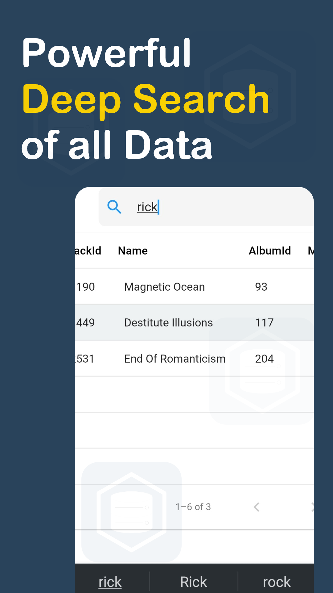

# SQLiteR - A SQLite Database Manager

## Screenshots

### Phone

<table>
  <tr>
    <td></td>
    <td></td>
    <td></td>
    <td></td>
  </tr>
  
  <tr>
    <td></td>
    <td></td>
    <td></td>
    <td></td>
  </tr>
</table>

### Tablet

<table>
  <tr>
    <td></td>
    <td></td>
  </tr>
  
  <tr>
    <td></td>
    <td></td>
  </tr>

  <tr>
    <td></td>
    <td></td>
  </tr>
</table>
